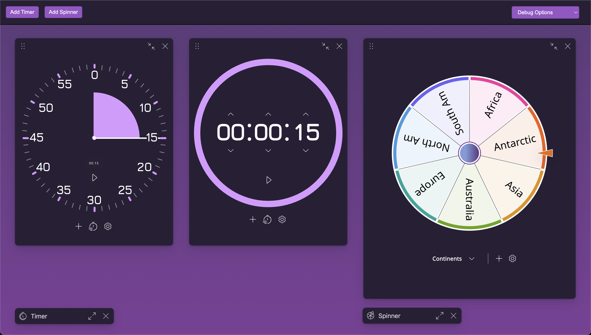
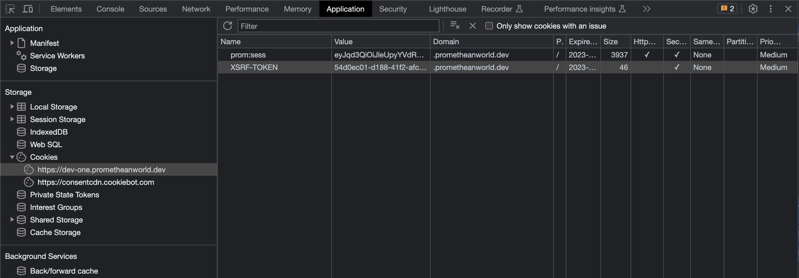

# App Frames



## Description

This package contains proof of concept code for rendering react iframe modals that can be
resized and dragged around the screen.

The contents of each app frame are driven by source url and can be any web page but were developed
specifically for displaying Timer and Spinner over other applications.

## Demo Usage

To start a local demo server run:
```
npm run dev
````

To ensure the demo works correctly, you need to ensure the `XSRF-TOKEN` cookie from the
promethean domain has the `SameSite` value set to `None` in your browser.

You can log into the Promethean development domain by visiting https://one.dev.prometheanworld.dev/1
and then open the developer tools and manually edit the cookie value.



### Environment Variables

The following environment variables are used by the demo application, and can be modified in the `.env` file:

`VITE_TIMER_URL` : Controls what url to load when 'Add Timer' is pressed. Defaults to https://timer.one.dev.prometheanworld.dev/

`VITE_SPINNER_URL` : Controls what url to load when 'Add Spinner' is pressed. Defaults to https://spinner.one.dev.prometheanworld.dev/


## Library Usage

```javascript
import { AppFrameModals } from '@explain-everything/app-frames';

const App = () => {
  const [appSources, setAppSources] = useState([
    {
      id: 'timer',
      title: 'Timer',
      url: 'https://timer.one.dev.prometheanworld.dev/1',
    }
  ]);

  return (
    <AppFrameModals
      sources={appFrames}
      onAppClose={(appSource) => setAppSources([])}
    />
  );
};
```

The sources prop is an array of objects with the following shape:
```typescript
export type AppSource = {
  id: string
  url: string
  title?: string
  minSize?: { width: number; height: number }
  defaultSize?: { width: number; height: number }
  defaultPosition?: { x: number; y: number }
}
```


## iFrame Communication

The apps rendered inside iframes can communicate with the parent window using the
[window.postMessage](https://developer.mozilla.org/en-US/docs/Web/API/Window/postMessage) API.

**Sample code for sending messages from the app frame to the parent window:**

```javascript
window.parent.postMessage({
  type: 'prom.v1.authError',
  message: 'Optional message payload',
});
```

**Sample code for receiving messages in the parent window:**

```javascript
window.addEventListener('message', (event) => {
  if (event.data.type === 'prom.v1.authError') {
    console.log('Auth Error', event.data.message);
    // Handle the authentication error
  }
});
```

**The following message types are currently supported:**

| Type                  | Description                                                                   |
|-----------------------|-------------------------------------------------------------------------------|
| `prom.v1.appLoaded`   | Sent when the app has authenticated and fully loaded                          |
| `prom.v1.authTimout`  | Sent when the app detects the authentication session has expired (403 errors) |
| `prom.v1.authError`   | Sent when the app fails to authenticate (401 errors)                          |
| `prom.v1.openNew`     | Sent when the app user clicks the + button to open a new modal                |

**Associated Types**

```typescript
/**
 * Message types that can be sent to the parent frame.
 * @enum {string}
 */
export enum AppMessageType {
  AppReady = 'prom.v1.appLoaded',     // App is loaded and ready to be exposed to user
  AuthTimeout = 'prom.v1.authTimout', // Auth token has expired, needs to be refreshed
  AuthError = 'prom.v1.authError',    // Auth was rejected, needs to handled
  OpenNew = 'prom.v1.openNew',        // Open a new app of the same type
}

/**
 * A model for an event that can be sent to the parent frame.
 * Using
 */
export interface AppMessage {
  type: AppMessageType
  message?: string
}
```
